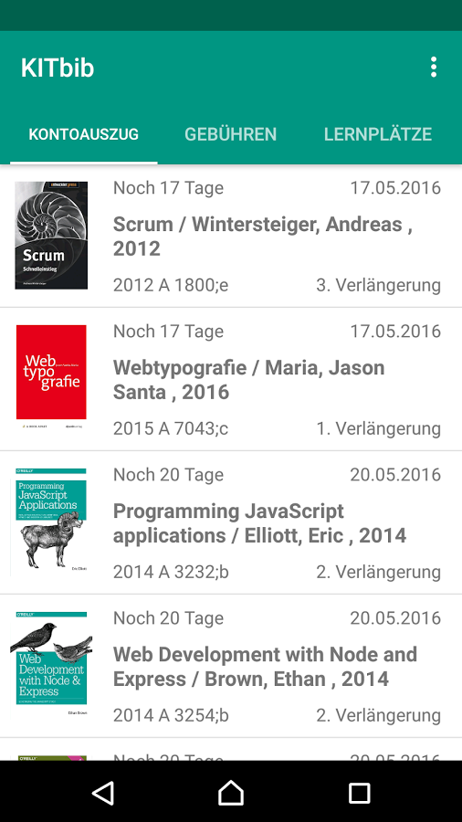
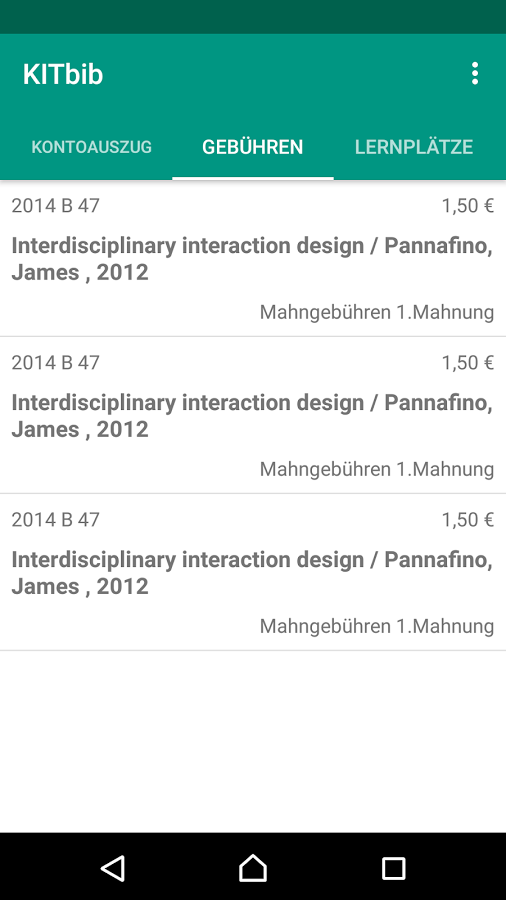
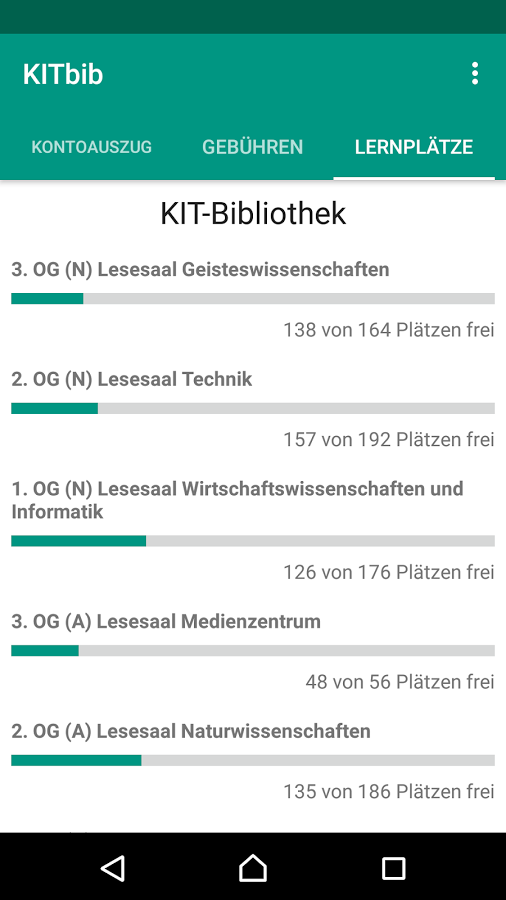

# KITbib - Bibliothek App

KITbib ist eine Android App, die dafür entwickelt wurde, einen mobilen Zugriff auf die Services der KIT Bibliothek der Universität und an Hochschulen in Karlsruhe zu ermöglichen. Neben dem Kontoauszug und der Gebührenübersicht kann man in der App die aktuelle Lernplatzbelegung einsehen.
  

 FUNKTIONEN    
 ☆ Kontoauszug: Übersicht über deine ausgeliehen Bücher    
 ☆ Gebührenübersicht: Offene Gebühren anzeigen    
 ☆ Lernplatzbelegung: Finde freie Plätze in den Bibliotheken    
 
 SO FUNKTIONIERT'S  
 • Pauschalverlängerung: Tippe oben rechts auf die drei Punkte und wähle "Pauschalverlängerung"  
 • Einzelverlängerung: Tippe auf das Buch das du verlängern möchtest und wähle "Verlängern"  
 • Abmelden: Tippe oben rechts auf die drei Punkte und wähle "Logout"    
 
 Für die Bibliotheken am Karlsruher Institut für Technologie (KIT), der Hochschule Karlsruhe - Technik und Wirtschaft (HsKA), und an der Dualen Hochschule Baden Württemberg (DHBW)
   

Kontoauszug             |  Gebühren | Lernplatzbelegung
:-------------------------:|:-------------------------:|:-------------------------:
  |  |  

## Install
Install directly from [here on github](https://github.com/denwehrle/kitbib-android/releases/latest) or stay up-to-date
automatically by installing via an app store:  

## Bugs and Feedback
For bugs, feature requests, and discussion please use GitHub Issues, contact me directly or just contribute yourself.

## Contributing

1. Fork it https://github.com/denwehrle/kitbib-android/fork 
2. Create your feature branch (`git checkout -b my-new-feature`)
3. Commit your changes (`git commit -am 'Add some feature'`)
4. Push to the branch (`git push origin my-new-feature`)
5. Create a new Pull Request

## License

    Copyright 2017 Dennis Wehrle
    
    Licensed under the Apache License, Version 2.0 (the "License");
    you may not use this file except in compliance with the License.
    You may obtain a copy of the License at

       http://www.apache.org/licenses/LICENSE-2.0

    Unless required by applicable law or agreed to in writing, software
    distributed under the License is distributed on an "AS IS" BASIS,
    WITHOUT WARRANTIES OR CONDITIONS OF ANY KIND, either express or implied.
    See the License for the specific language governing permissions and
    limitations under the License.
